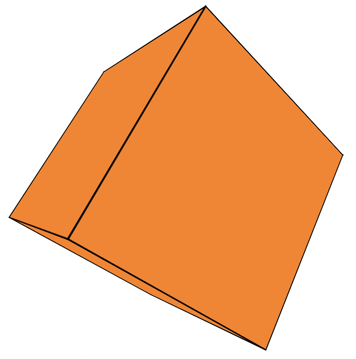

# Cube 3d css

<br>

>npm i 3d-cube-css

```js
import createCube from '3d-cube-css';
```

>create div with id and class in html
```html
id="cube-container" class="cube-container"
````

>calling createCube function with options <mark>Only size to work</mark>

```js
createCube(
  {
    size: 300, 
    wireframes: true, //option
    rotate: true, //option 
    rotY: 1, //option
    rotX: 1, //option 
    imgSrc: 'img.svg' //option,
    bgColor: '#f0f0f0' //option black default
  }
)
```